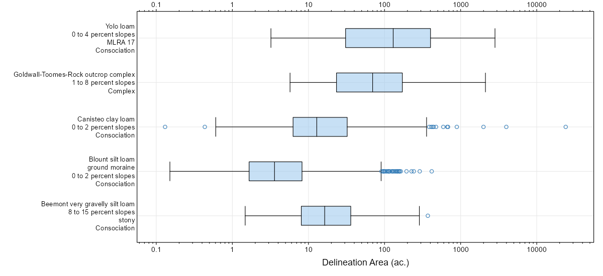
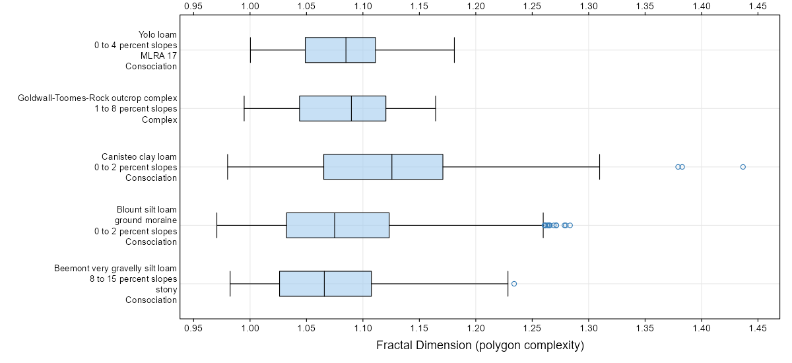

# Intuitive Explanations of Mapping Scale, Survey Order, and MMU

## TODO:
   * review D.G. Rossiter's [SSM Lecture Notes](http://www.css.cornell.edu/faculty/dgr2/teach/ssm/SSM_LectureNotes2.pdf) on cartographic definitions / thresholds.

## Ideas

Survey order is very useful tool for constraining field investigations, MU development, delineations, and more recently, map finishing applied to statistical predictions of soil class / property. This should in fact be obvious to us but it is easy to overlook when pixel size is substituted for "scale".

| order| approx_scale| MMU_low_ac| MMU_high_ac| approx_line_width_ft| n_30m_px_low| n_30m_px_high| n_90m_px_low| n_90m_px_high| single_px_size_m|
|-----:|------------:|----------:|-----------:|--------------------:|------------:|-------------:|------------:|-------------:|----------------:|
|     2|        12000|        1.5|          10|                   40|            7|            45|            1|             5|              150|
|     3|        24000|        4.0|          40|                   80|           18|           180|            2|            20|              280|
|     4|        65000|       40.0|          600|                  215|          180|          2790|           20|           310|              450|

Line width and representative areas seem like intuitive ways to relate this information. For example, as the users zooms well-beyond the 1/2 SSA scale limit in WWW, the lines could be converted into bands that are 40' wide for order 2 mapping, 80' wide for order 3, and ~ 200' wide for order 4.

Example delineations or simulated patches near the MMU area would be used to illustrate the smallest resolvable unit in the AOI. This could be overlaid on local imagery or a set of relatable objects such as football field (~ 1.3 ac.), city block (~ 6 ac.), section (640 ac.), etc..

Here is an example from CA654 (1:24k, published 1966). The 70 ac. delineation used here is symbolized with a 24m (80 ft.) wide band. A randomly located point is buffered to symbolize a practical MMU of 7 ac. (middle of the MMU range for order 3 mapping).

## Nested Grid Overlay

White lines are order 3 soil mapping (1:24,000 scale) [near Fresno, CA](https://casoilresource.lawr.ucdavis.edu/gmap/?loc=36.7182,-119.8650) (CA630). Three grid sizes for context: yellow (810m), orange (270m), and red (90m). Juggling pixel size / implied scale, minimum mapping unit (MMU) / detail resolvable given limited time and data.

## Three Survey Areas in CA, one in MO
  
   * MO071: order 3
   * CA630: order 3
   * CA792: order 3/4
   * CA790: order 4
   
   

## Representative Map Units
Summaries of delineation area and fractal dimension for four map units representing different survey orders and complexity.

TODO: exemplars of 5th - 50th - 95th percentiles of fractal dimension would be an excellent exhibit for the Soil Survey Manual.

## Geomorphons as Context
Consider landforms elements (raster base map) as delineated by the [geomorphons](https://grass.osgeo.org/grass77/manuals/r.geomorphon.html) algorithm, from Sequoia National Park, CA. White lines are the map unit polygons from an order 3/4 soil survey.

In general, the landform elements are 1-2 orders of magnitude more detailed than the map unit delineations.

## MU Complexity Evaluation via Fractal Dimension

http://www.umass.edu/landeco/research/fragstats/documents/Metrics/Shape%20Metrics/Metrics/P9%20-%20FRAC.htm

